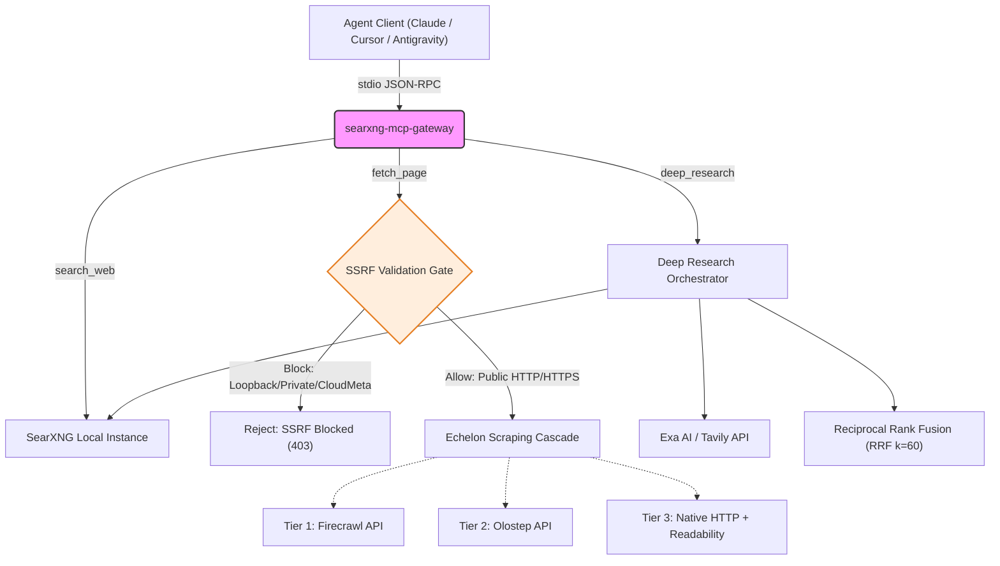
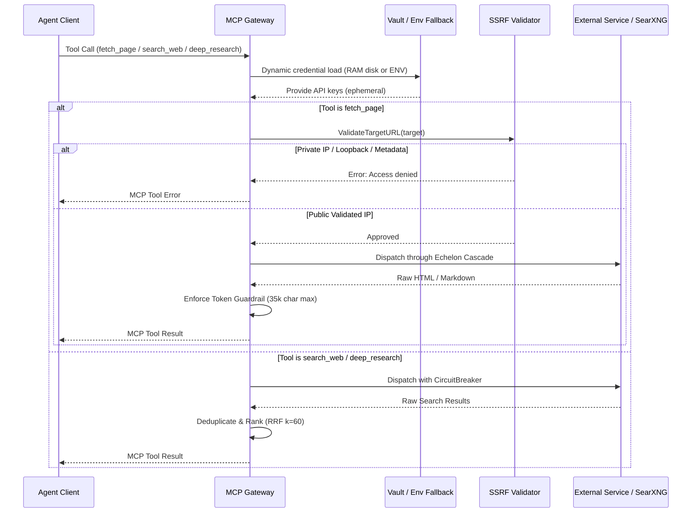

# Architecture & Flow: searxng-mcp-gateway

📚 **Documentation Suite:** [README](README.md) • [Agent Directives](AGENTS.md) • [Contributing](CONTRIBUTING.md) • [Security Policy](SECURITY.md) • [Code of Conduct](CODE_OF_CONDUCT.md) • [License](LICENSE)

This document outlines the high-level architecture and request flow for `searxng-mcp-gateway`, emphasizing the resilient integration components that power the NovaNodes agent collective and open-source MCP consumers.

---

## System Flow

The gateway acts as an intermediary bridging the autonomous agent collective (via MCP JSON-RPC protocol over `stdio`) with local search infrastructure and resilient web retrieval services.

---

## Request Flow

Each tool request executes with bounded context timeouts, dynamic credential resolution, and defense-in-depth safety guardrails.

---

## Core Components

### 1. SSRF Protection Gate (`internal/echelon/ssrf.go`)
Before any external URL is scraped, the gateway validates the target against a strict security policy:
- Rejects non-HTTP/HTTPS schemes (`file://`, `ftp://`, `gopher://`, etc.).
- Pre-resolves hostnames against system DNS.
- Blocks connections to IPv4 loopback (`127.0.0.0/8`), IPv6 loopback (`::1`), RFC 1918 private address ranges (`10.0.0.0/8`, `172.16.0.0/12`, `192.168.0.0/16`), Carrier-grade NAT (`100.64.0.0/10`), and cloud instance metadata addresses (`169.254.169.254`).
- Intercepts HTTP redirect responses (`CheckRedirect`) to ensure redirect targets do not pivot into internal networks.

### 2. Echelon Scraping Cascade (`internal/echelon`)
The `fetch_page` capability employs an automated 3-tier cascade to ensure high success rates while bypassing anti-bot/WAF challenges:
- **Tier 1:** Firecrawl API (full JS rendering and markdown extraction).
- **Tier 2:** Olostep API (alternative distributed browser scraping).
- **Tier 3:** Native HTTP client with browser header rotation and Readability content parsing.

If a tier fails or times out, the system automatically escalates to the subsequent tier within the remaining context deadline.

### 3. Dual-Mode Key Vault (`internal/vault`)
Credentials for paid discovery and scraping services are loaded on demand:
- **Primary:** Read from `/dev/shm/agent_vault/<KEY_NAME>` (RAM-disk, non-persistent).
- **Fallback:** Standard environment variables (`EXA_API_KEY`, `TAVILY_API_KEY`, `FIRECRAWL_API_KEY`, `OLOSTEP_API_KEY`).
- Ephemeral lifecycle: Keys are queried per-request and never stored in static memory structures.

### 4. Circuit Breaker (`internal/circuitbreaker`)
Outbound calls to third-party endpoints are protected by a thread-safe Circuit Breaker:
- Tripped by repeated `net.Error` timeouts or HTTP status codes `401`, `403`, `429`, or `5xx`.
- Rapidly fails subsequent calls during downstream degradation to prevent agent hanging.
- Recovers via half-open probe requests after an exponential backoff interval.

### 5. Reciprocal Rank Fusion (RRF, $k=60$)
The `deep_research` tool executes concurrent queries against local SearXNG and external discovery engines (Exa / Tavily), merging results without requiring intermediary LLM synthesis:
- Formula: $Score = \sum \frac{1}{k + rank_i}$ where $k=60$.
- Normalizes disparate ranking systems and deduplicates matching URLs.

### 6. Token Guardrail
To safeguard model context budgets across long-running autonomous agent workflows:
- Scraped content is limited to a strict 35,000-character ceiling.
- Clean truncation prevents unexpected context overflows.

### 7. Stdio IPC Stream Isolation
- `os.Stdout` is strictly reserved for the MCP JSON-RPC protocol transport (`mark3labs/mcp-go`).
- All server diagnostics and operational traces are directed to `os.Stderr` via Go's standard `log/slog`.
