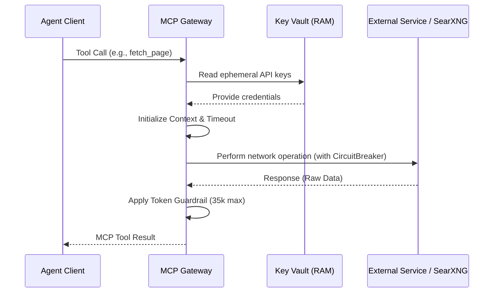

# Architecture & Flow: searxng-mcp-gateway

This document outlines the high-level architecture and request flow for `searxng-mcp-gateway`, emphasizing the resilient integration components that power the NovaNodes agent collective.

## System Flow

The gateway acts as an intermediary bridging the autonomous agent collective (via MCP protocol) with search and web retrieval infrastructure.

```mermaid
graph TD
    A[Agent Collective (mcp-client)] -->|stdio| B(searxng-mcp-gateway)
    B -->|search_web| C[SearXNG Local Instance]
    B -->|fetch_page| D[Echelon Scraping Cascade]
    B -->|deep_research| E[Deep Research Orchestrator]
    
    D -.-> F[Firecrawl API]
    D -.-> G[Olostep API]
    D -.-> H[Native HTTP Client]
    
    E --> C
    E --> I[Tavily / Exa AI]
    
    style B fill:#f9f,stroke:#333,stroke-width:2px
```

## Request Flow

Each request is processed using strict context timeouts, dynamic configuration loading, and resilience mechanisms.



## Core Components

### 1. Echelon Scraping Cascade

The `fetch_page` capability employs a resilient 3-tier cascade to ensure consistent data extraction and WAF/Cloudflare bypass.

*   **Tier 1:** Firecrawl (Primary extraction provider)
*   **Tier 2:** Olostep (Fallback extraction)
*   **Tier 3:** Native HTTP Request (Failsafe)

If a tier fails, the system automatically escalates to the next tier within the bounded request context.

### 2. CircuitBreaker

Network resilience is implemented using a thread-safe CircuitBreaker designed to rapidly fail operations when downstream services exhibit instability.

*   **Failure Thresholds:** The circuit opens upon detecting repeated `net.Error` timeouts or HTTP status codes `401`, `403`, `429`, or `5xx`.
*   **Retry Backoff:** The system introduces an exponential backoff before allowing the circuit to transition to a half-open state for recovery testing.

### 3. Reciprocal Rank Fusion (RRF)

The `deep_research` tool aggregates results from multiple heterogeneous sources (SearXNG + Exa AI / Tavily). Results are combined and deduplicated using the Reciprocal Rank Fusion (RRF) algorithm.

*   **Formula:** $Score = 1 / (k + rank)$
*   **Constant ($k$):** Set to `60` by default.

This ensures high-quality ranking without relying on fragile ML models for synthesis.

### 4. Token Guardrail

To protect downstream LLM context windows, all scraped content passes through a strict Token Guardrail.

*   **Budget:** 35,000 characters maximum.
*   **Behavior:** Text exceeding this limit is cleanly truncated before being returned as the MCP tool result. No hallucinated summaries are generated.
