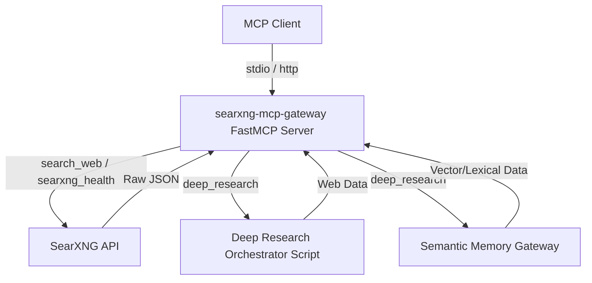

# Architecture

This document describes the high-level architecture and data flow of the `searxng-mcp-gateway`.

## Data Flow Diagram

## Internal Logic & Modules

### `server.py`
This is the core module that defines the MCP server using `FastMCP`.
- **Initialization**: The script dynamically adjusts `sys.path` to include the `memory-gateway` package, allowing for semantic memory integration when `deep_research` is called.
- **Tool Registration**: Three MCP tools are exposed via the `@mcp.tool` decorator:
  - `search_web`: Routes directly to the internal `_searxng_search` function which handles the API request to SearXNG. It processes pagination, categories, and safety filters.
  - `searxng_health`: Provides diagnostic information by polling the SearXNG `/search` and `/config` endpoints.
  - `deep_research`: Acts as an orchestrator that concurrently interfaces with an external shell script (the deep research orchestrator) and a local semantic search function (from `memory-gateway`), merging their outputs into a single response payload.

### `config.py`
Manages all environmental configurations. It centralizes variables such as the SearXNG endpoint URL, default search parameters, timeouts, and toggles for experimental features like semantic memory integration. The configuration values are synced with `.env` settings.

### TODO
Mathematical models, advanced processing pipelines, and complex algorithm calculations are currently not present in the codebase.
